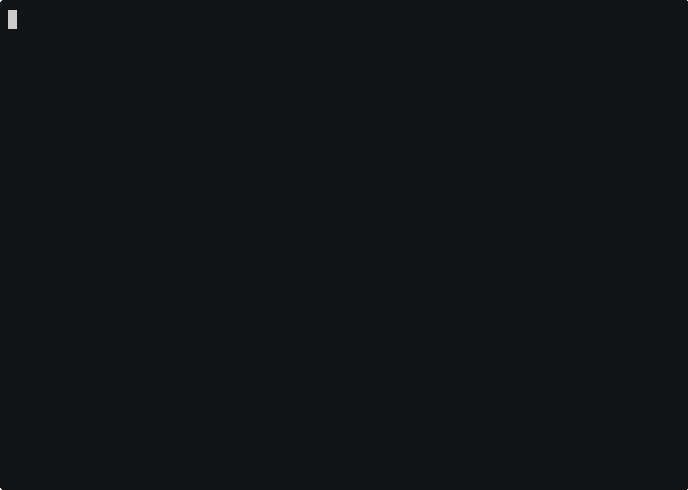

# rtsp-record

Record an RTSP stream to disk in fixed-duration segments. Wraps
[`ffmpeg`](https://ffmpeg.org)'s segment muxer with `-c copy` (no re-encode,
preserves the camera's bitrate and CPU on the host).

## Demo

Watch with pause/seek on [asciinema.org](https://asciinema.org/a/8LEaWhV5O7VHgv5z).

## Install

    chmod +x rtsp-record
    cp rtsp-record ~/.local/bin/    # or /usr/local/bin/
    apt install ffmpeg

## Usage

Record indefinitely in 10-minute segments (the defaults):

    rtsp-record rtsp://192.168.1.64/live/ch00_1

Pipe from `onvif-rtsp` and write into a specific folder, with a custom
filename pattern and 60-second segments:

    onvif-rtsp --user admin --password segreta --inject-credentials \
        http://192.168.1.64/onvif/device_service \
      | rtsp-record -d 60 -o "/srv/footage/cam1-%Y%m%d-%H%M%S.mkv"

Record exactly 6 segments (1 hour at the default duration) then stop:

    rtsp-record --max-segments 6 \
        -o "cam1-%Y%m%d-%H%M%S.mkv" \
        rtsp://192.168.1.64/live/ch00_1

### Flags

| Flag | Default | Meaning |
|---|---|---|
| `RTSP_URL` (positional) | from stdin | RTSP URL (`rtsp://` or `rtsps://`) |
| `-d`, `--duration SECONDS` | `600` | length of each segment, in seconds |
| `-o`, `--output PATTERN` | `recording-%Y-%m-%d_%H-%M-%S.mkv` | output filename pattern; **must contain at least one strftime placeholder** so segments do not overwrite each other. Default container is Matroska (.mkv) so partial segments after a crash stay playable and any RTSP audio codec (e.g. PCM µ-law) is accepted. |
| `--transport {tcp,udp}` | `tcp` | RTSP transport |
| `--max-segments N` | `0` | stop after N completed segments; `0` = run until interrupted |
| `-v`, `--verbose` | off | log progress and ffmpeg's stderr (filtered to segment-rotation lines plus everything else when `-v`) |
| `-V`, `--version` | | print version and exit |
| `-h`, `--help` | | show help and exit |

Stdin handling matches `onvif-rtsp`: if `RTSP_URL` is omitted, the first
non-empty line of stdin is used.

### Behaviour

- The script does not re-encode (`-c copy`), so the on-disk bitrate matches
  the camera's. CPU usage is minimal.
- The pattern must include at least one `%X` strftime placeholder; otherwise
  segments would overwrite each other. The script refuses to start in that
  case.
- The output directory must already exist. The script does not create it.
- On `Ctrl-C` (or `SIGINT`), the script forwards `SIGINT` to ffmpeg so the
  in-flight segment is finalised cleanly (it is **not** killed with `SIGKILL`).
- With `--max-segments N`, the script asks ffmpeg to stop as soon as segment
  `N+1` is opened, so you may see a small trailing partial file in addition to
  the N completed ones.

Stdout is left empty — `rtsp-record` is a sink, not a pipeline producer.

## Exit codes

| Code | Meaning |
|---|---|
| 0 | success (clean stop, or `--max-segments` reached) |
| 1 | usage error (missing/bad flag, missing pattern placeholder, missing output directory, ffmpeg not in PATH) |
| 4 | ffmpeg exited with a non-zero status |
| 130 | interrupted with Ctrl-C |

## Dependencies

- Python 3.8+ (stdlib only)
- `ffmpeg` (any reasonably recent version with the `segment` muxer)

## Place in the chain

    onvif-discover → onvif-rtsp → go2rtc-gen → rtsp-play / rtsp-record → footage-merge

`rtsp-record` consumes one RTSP URL and produces files on disk. To stitch its
segments back into a single playable video, feed them to
[`footage-merge`](https://github.com/SweatierKey/footage-merge).
